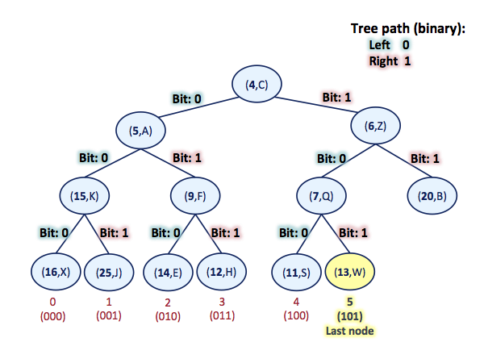

Implement method findLastPosition, which returns the Node corresponding to the last position of a heap with n elements implemented using a linked binary tree.

The time complexity of the method should be O(h), where h is the height of the tree.

Note that the last position of a heap is the last (or rightmost) leaf of the last level, at height h.

For the example heap in the figure below, the last position corresponds to the node highlighted in yellow.

Remember that the number of nodes in the last level (and therefore the index of the last position) can be calculated using the total number of nodes n in the heap, since a heap is a complete binary tree.

In addition, you can obtain the path from the root to the last position by taking the rightmost h bits in the binary representation of its index within the last level. Each bit indicates which child to follow at each level: 0 for left and 1 for right.

For the example heap in the figure above:
- The height is 3.
- The last position has index 5 which translates into the following 32-bit representation: 00000000 00000000 00000000 00000101
- Taking the h rightmost bits in this binary representation results in 101, indicating that we can directly follow the path right -> left -> right from the root in order to find the last position.

If the index is stored as an integer variable in Java (int index;), you can use a bit mask to sequentially extract the bits of the path as follows:
- Create bit mask to extract the first bit: int mask = 1 << (h-1); (shift 0..00 0..00 0..00 0..001 left h-1 times, resulting in 0..00 0..00 0..00 0..100 for the example above)
- Update mask for next level: mask >> 1 (shift current mask once to the right: if the current mask is 0..00 0..00 0..00 0..100, this will result in 0..00 0..00 0..00 0..010)
- Test the bit using the current mask to decide left or right at the current level: index & mask (bitwise “and” operation that evaluates to 0 if the given bit is 0, or non-zero integer if the given bit is 1)

We provide an implementation of class Heap (and its inner class Node) in the visible Library code.

An object of type Heap stores a reference to the root Node of the heap and also the total number of Nodes in the heap, which can be obtained by calling methods getRoot and size, respectively.

Each Node in the Heap has a reference to its left child Node and a reference to its right child Node (each reference can be null if the child does not exist). These are not directly available via the Node, they can be accessed using methods in the Heap class.

Note that if you want to access the Node class, you need to write Heap.Node (you can find examples of this in the visible Library code).

IMPORTANT: If the complexity of your solution is not O(h), you will get 0 points for this assignment.
